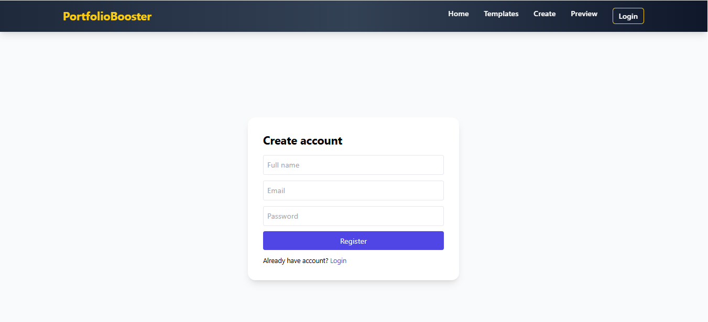
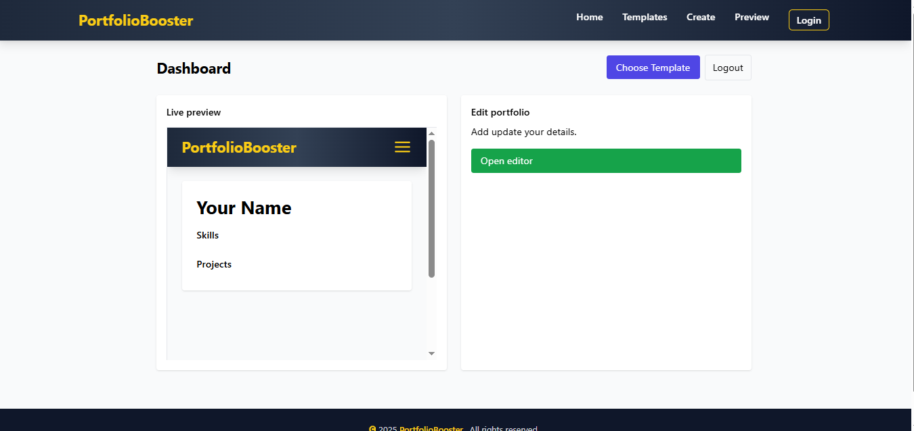
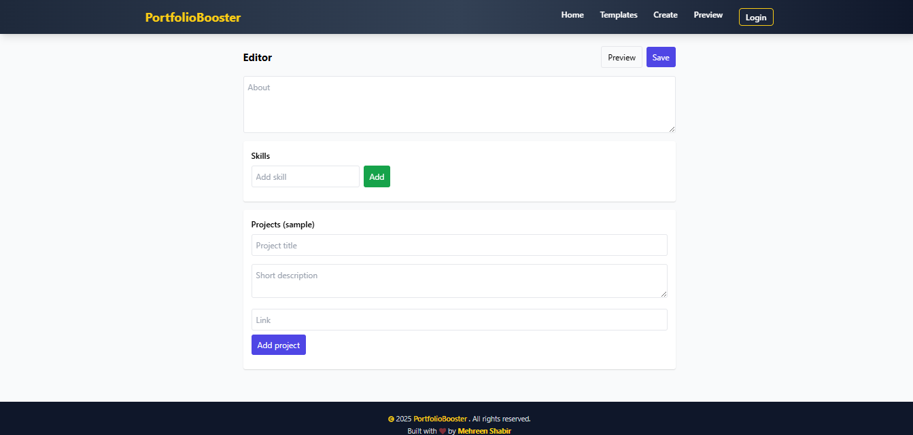

🌐 Portfolio Generator (MERN)

A Portfolio Generator Web Application built using the MERN Stack (MongoDB, Express, React, Node.js).
This platform allows users to create their own professional portfolio websites within minutes — simply by registering, choosing a template, and entering their details.

🚀 Features

🔐 User Authentication – Secure Login & Signup using JWT.

🎨 Portfolio Templates – Choose from multiple pre-designed, responsive templates.

🧾 Dynamic Form Input – Fill personal info, skills, experience, education, and projects.

⚡ Real-time Preview – Instantly preview your portfolio before saving.

📱 Fully Responsive – Works perfectly on mobile, tablet, and desktop.

☁ Auto Hosted Portfolio – Instantly generated shareable portfolio link.

🏗 Tech Stack

Layer	Technology Used

Frontend	React.js, Axios, React Router, Tailwind CSS / Bootstrap
Backend	Node.js, Express.js
Database	MongoDB (Mongoose ODM)
Authentication	JWT (JSON Web Token)
Environment Config	dotenv
Version Control	Git & GitHub

 Folder Structure

Portfolio-Booster/
│
├── client/                 # Frontend (React)
│   ├── public/
│   ├── src/
│   │   ├── components/
│   │   ├── pages/
│   │   ├── api/
│   │   ├── App.js
│   │   └── index.js
│   └── .env
│
├── server/                 # Backend (Node + Express)
│   ├── models/
│   ├── routes/
│   ├── controllers/
│   ├── server.js
│   └── .env
│
└── README.md

⚙ Installation & Setup

🔹 Prerequisites

Make sure you have installed:

Node.js (v16 or above)

MongoDB

npm or yarn

🔹 Step 1: Clone the Repository

🔹 Step 2: Setup Backend

cd server
npm install

Create a .env file inside the server folder:

PORT=5000
MONGO_URI=your_mongodb_connection_string
JWT_SECRET=your_secret_key

Start the backend:

npm start

🔹 Step 3: Setup Frontend

cd client
npm install

Create a .env file inside the client folder:

REACT_APP_API_URL=http://localhost:5000/api

Run the frontend:

npm start

💻 Usage Flow

1. Register / Login → Create your user account.

2. Select Template → Choose from available portfolio designs.

3. Enter Details → Fill in your personal, education, and work details.

4. Generate Portfolio → Instantly preview and save your portfolio.

Future Improvements

Add more portfolio templates

Allow users to upload profile images and PDFs

Integration with GitHub API to show latest projects

Custom domain linking for portfolios

👩‍💻 Author

Mehreen Shabir
🎯 Full Stack Developer (MERN)

